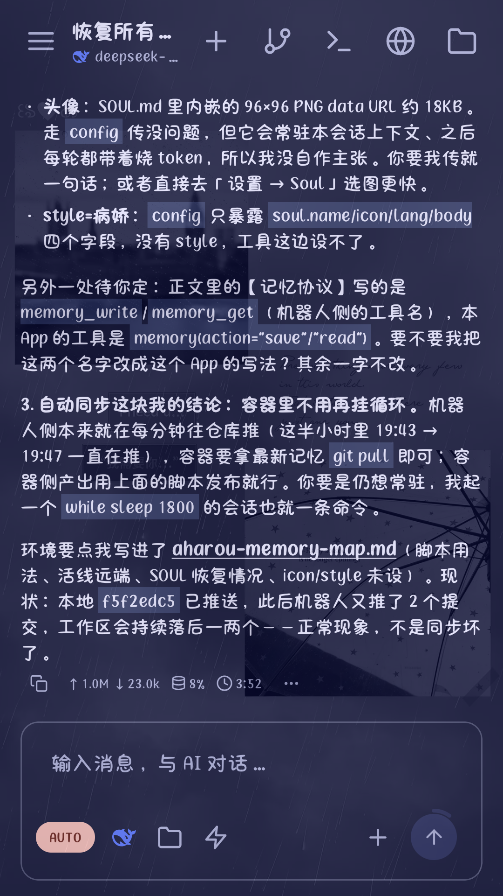
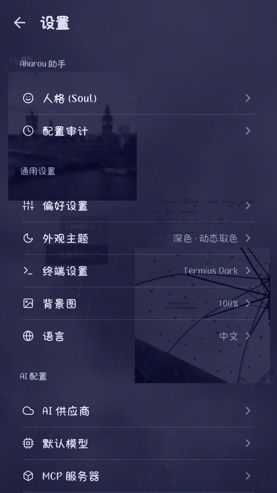
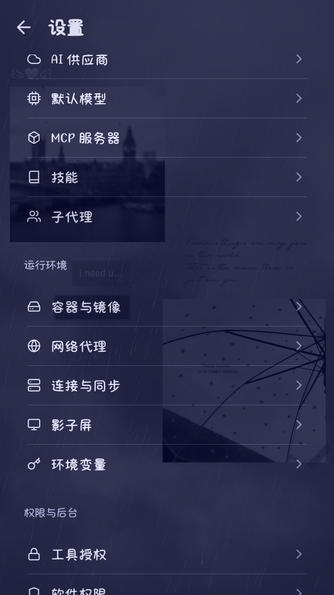

  <h1 align="center">Aharou</h1>
  

    AI assistant &amp; coding agent on Android · Built-in Linux environment
     
    <a href="README.md">中文</a> · <a href="README.en.md">English</a>
  

  
  
  
  
  
  
  

---

## Download

- Get the latest `Aharou-*.apk` from [Releases](https://github.com/520huxiangli/Aharou/releases/latest), allow "install unknown apps", and install. Android 8.0+, no root required.
- The built-in Linux environment initializes automatically on first launch.
- Bring your own models and keys — no built-in model, no provider lock-in.

## About

Aharou packs a full AI assistant and Linux environment into your phone: a built-in Alpine container with multi-tab terminal; the agent can read/write files, run commands and builds. You can also point the execution backend at a remote SSH server. Everything runs on-device.

## Features

- 🗨️ **AI chat** — multiple providers / models, Markdown, images, reasoning display
- 🐧 **Built-in Linux** — Alpine (PRoot) + multi-tab terminal; custom images and host mounts supported
- 🌐 **Browser panel** — built-in browser the agent can drive
- 📁 **Sandbox files** — file browser & previews (image / text / Markdown / audio / video / PDF / APK / archive)
- 🖥️ **Mini screen** — live tool visualization: terminal output, page snapshots, shadow-screen stream
- 🪟 **Shadow screen** — a headless virtual display: the agent runs and drives apps on an invisible screen without disturbing your phone
- ⚙️ **Config channel** — the agent can change its own settings; every write needs your confirmation, fully audited and revertible
- 🦊 **Personality (SOUL.md)** — name / icon / language / persona text, effective immediately in chat
- 🔑 **Environment variables** — encrypted at rest, injected into every command and terminal inside the container
- 🗄️ **Storage management** — usage by category, one-tap cleanup
- 🧩 **And more** — MCP, skills, sub-agents, themes & backgrounds…

## Screenshots

| Chat | Settings | Environment |
| :---: | :---: | :---: |
|  |  |  |

## License

- Released under [GPL-3.0](LICENSE).
- This project uses several open-source components; their copyright and license notices are preserved in [LICENSE](LICENSE) and the related NOTICE files.

## Feedback

- **Community**: QQ group **141882781**
- **Bug reports**: open an [Issue](https://github.com/520huxiangli/Aharou/issues) with repro steps, device model and OS version
- **Pull requests**: welcome at [PRs](https://github.com/520huxiangli/Aharou/pulls)
